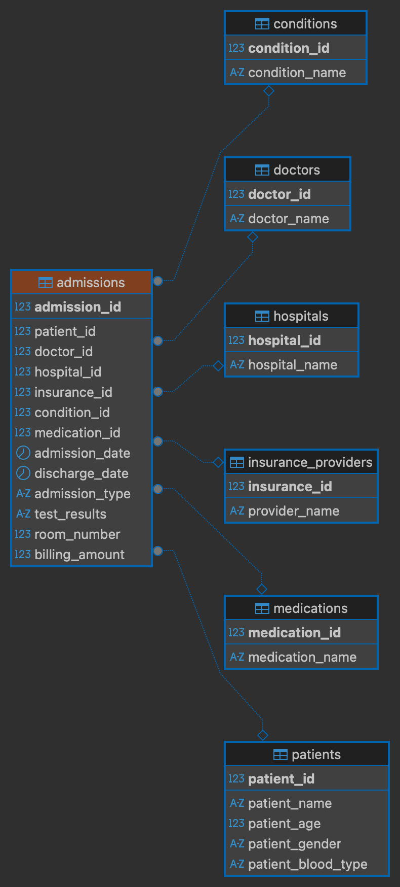
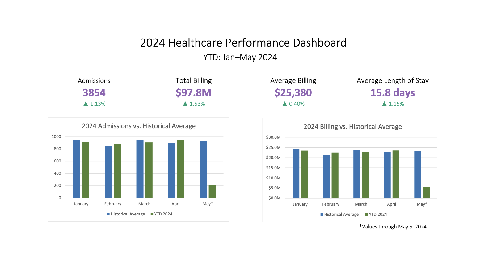

# Healthcare Data Project
This project explores the process of sourcing and analyzing a large dataset. A large healthcare dataset was transformed into a prostgresql database. SQL analysis was then used to create two Excel dashboards to understand the database at a glance.

## Dataset

The [dataset used](https://www.kaggle.com/datasets/prasad22/healthcare-dataset) is a generic dataset with synthetic healthcare data from Kaggle. It includes 55,000 entries each with the following fields:

1. Name
2. Age
3. Gender
4. Blood Type
5. Medical Condition
6. Date of Admission
7. Doctor
8. Hospital
9. Insurance Provider
10. Billing Amount
11. Room Number
12. Admission Type
13. Discharge Date
14. Medication
15. Test Results

This dataset was chosen because it is large and the medical field has many real world statistical analysis applications which would be relevant in the SQL analysis portion of the project. The data was also relatively clean allowing for less focus to be placed on transformation, and more to be placed on the database aspects of the project.
## Transformation
The dataset was relatively clean so little transformation was necessary. The original .csv file was read using Python pandas. There were no missing fields or problematic characters in the dataset so the only necessary data cleaning was fixing case issues in names as well as normalizing dates to a format readable by postgresql.
## Database Design

The Python library psycopg2 was used to connect to a locally hosted postgresql database. The database was designed to have 7 tables storing the following information:

1. Patients
	a. patient_id   (pk)
	b. patient_name
	c. age
	d. gender
	e. blood_type
2. Doctors
	a. doctor_id   (pk)
	b. doctor_name
3. Hospital
	a. hospital_id   (pk)
	b. hospital_name
4.  Medications
	a. medication_id   (pk)
	b. medication_name
5.  Insurance_Providers
	a. insurance_id  (pk)
	b. insurance_name
6.  Conditions
	a. condition_id   (pk)
	b. condition_name
7. Admissions
	a. admission_id  (pk)
	b. patient_id (fk)
	c. doctor_id (fk)
	d. hospital_id (fk)
	e. insurance_id (fk)
	f. condition_id (fk)
	g. medication_id (fk)
	h. admission_date 
	i. discharge_date 
	j. admission_type 
	k. test_results 
	l. room_number
	m. billing_amount 

The first 6 tables were populated with all unique entries of their respective field. Each entry into the database had exactly one entry in each field so there was no need to consider cases such as multiple conditions or medications per visit. The admissions table served as the central table and referenced all others while simultaneously storing all information relevant to exactly one visit.

## SQL Analysis and Dashboard Design

KPIs identified were split into two groups, each with their own Excel dashboard. The first dashboard was designed to be viewed by high level executives and give the most relevant information at a glance. It includes metrics such as total revenue and total admissions in the current year compared to the previous year as well as how the current year is performing month to month compared to historical averages.

The second diagram was created to be read by financial advisors and shows KPIs relating to finances giving projections for future workload and revenue. These projections were calculated by identifying trends in admissions in previous years to estimate trends in the current year. It also identifies the most productive and least productive hospitals. 

> Written with [StackEdit](https://stackedit.io/).
